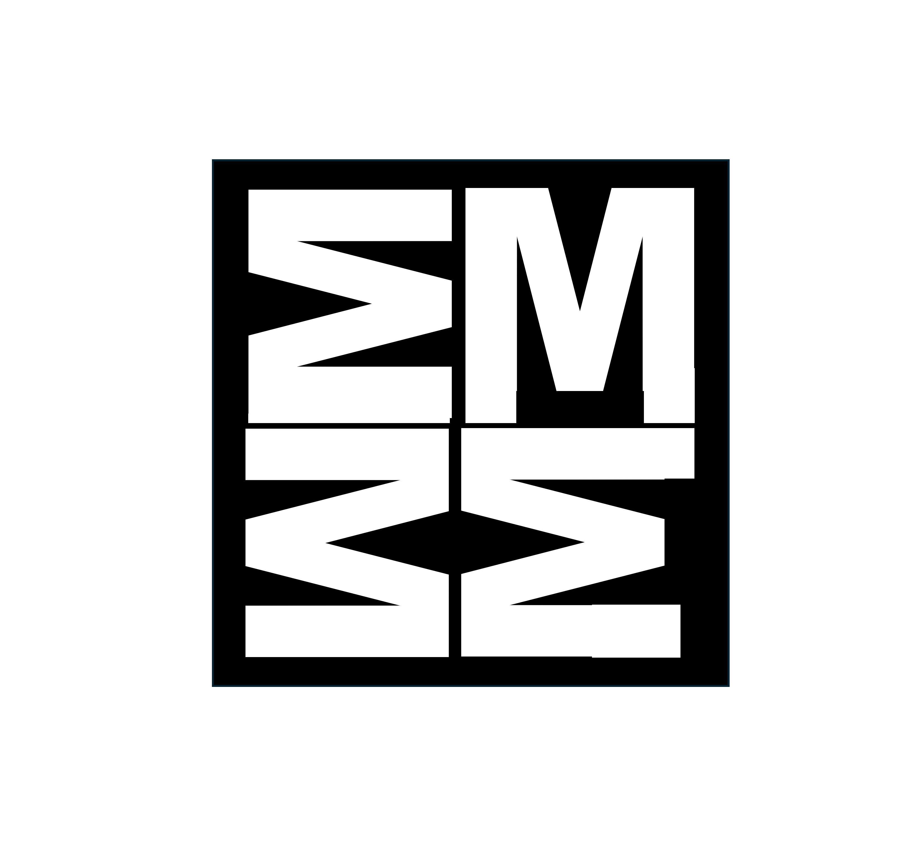
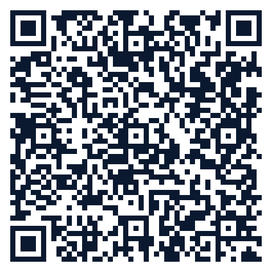

## EmmBee.One

Structured Academic Mentoring

# Class 10 Board Exam Stress Buster Kit

Official CBSE-approved techniques to stay calm, focused & confident

✅ BACKED BY CBSE OFFICIAL GUIDELINES

**Dear Class 10 Student & Parent,**

Exam stress is completely normal — and the Central Board of Secondary Education (CBSE) has officially recognised it. This kit is built 100% from CBSE's own stress-management resources so you can face the 2026 boards with clarity and confidence.

## 📌 CBSE's Official 5 A's to Control Exam Stress

1**Acknowledge** – Accept that stress is natural. Every student feels it.

2**Appreciate** – Focus on what you have already prepared instead of what is left.

3**Alleviate** – Use relaxation techniques (deep breathing, short breaks).

4**Alter** – Change negative thoughts into realistic ones.

5**Avoid** – Avoid last-minute cramming and comparison with others.

## 🧘 5 Instant Relief Techniques (CBSE Recommended)

1. Deep Breathing (5 seconds) Shut your eyes → Inhale for 4 counts → Hold 4 → Exhale 6. Repeat 5 times. CBSE calls this "the quickest and most effective way".

2. Progressive Muscle Relaxation Tighten and release each muscle group (toes → face) for 5 seconds each. Reduces physical tension instantly.

3. 4-7-8 Breathing Keep inhaling for 4 seconds → Hold breath for 7 seconds → Exhale slowly in 8 seconds. CBSE-endorsed relaxation technique.

4. Positive Self-Talk Replace "I will fail" with "I am prepared and I will do my best".

## 📅 7-Day Pre-Exam Routine (CBSE Approved)

🌅 Sleep 7–8 hours every night

🥗 Eat balanced meals + stay hydrated

🚶 20–30 minutes light exercise or walk daily

📝 Make a realistic timetable – 6–8 hours study with breaks

🧘 10 minutes yoga or meditation

## ⏱️ In the Exam Hall – 60-Second Reset

Read question paper calmly → Take 3 deep breaths → Start with easy questions.

## 💡 Powerful Affirmations (CBSE-recommended mindset shift)

"I am calm and focused" "I have prepared well" "One question at a time" "This is just one exam"

### 📞 You Are Not Alone – Official CBSE Help

1800-11-8004

24×7 Toll-Free Psycho-Social Counseling

Available in Hindi & English

**Full sources & links:**  
• Exam Stress: <a href="https://www.cbse.gov.in/examstress.htm" target="_blank">cbse.gov.in/examstress.htm</a>  
• Exam Anxiety Tips: <a href="https://www.cbse.gov.in/examanxiety.htm" target="_blank">cbse.gov.in/examanxiety.htm</a>  
• Psycho-Social Counseling: CBSE Official Press Release 06 Jan 2026

### Ready to turn stress into success?

Precision to the core in Maths and Science starts with a Strategy Walkthrough. Let's bridge the gaps together.

 **Scan to Discuss Results with Manoj Sir**

Visit **www.emmbee.one** to book your free session.

Made with care by **EmmBee.One** • Structured Academic Mentoring • Dehradun

